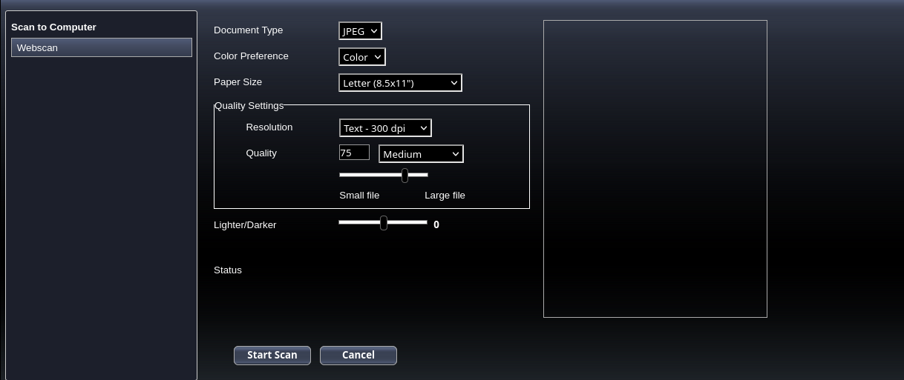
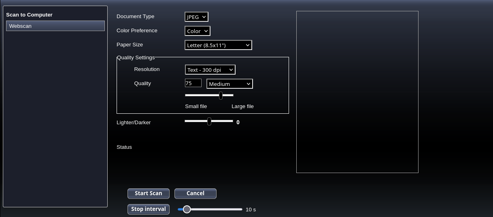

# HPD2540WebScanAutomation
Utility script to automate scanning with an HP Deskjet Ink Advantage 2540 All-in-One Printer

[scan-interval.js](scan-interval.js) is an script to add some util buttons to the printer UI to reduce the number of times you have to press the scan button.

Before applying the script

After applying the script

## Usage

1. Copy the script

2. Go to the printer webpage

3. Paste the script in the browser dev tools (`F12` or `Ctrl+Shift+c` to open dev tools).

4. Click **Start scan** to start the first scan and an interval will be set to automatically click the **Start scan** button every `n` seconds (defined with the slider next to the **Stop interval** button). You won't need to click the button again 😉 (although you still need to save the scan. See below).

## TODO's

- It'd be nice if the download (Save Image As...) process is also automated.

IDK how to do this with JS, I don't think it is possible or may require much more code and possibly reverse-engineer the web app.
